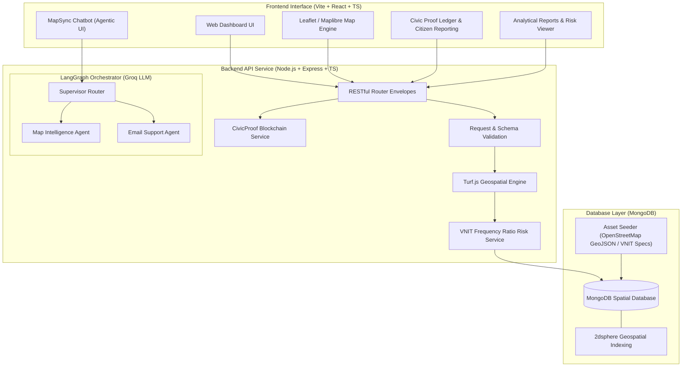

# Jal Setu Nagpur — GIS-Based Urban Flood Intelligence Platform

> **Data-driven urban flood risk modeling, spatial drainage analysis, citizen crowd-reporting, civic intervention tracking, and Agentic AI assistance for Nagpur, Maharashtra.**

---

## Overview & Context

Nagpur faces recurrent, severe urban flooding during monsoon events due to rapid urbanization, inadequate drainage capacity, natural channel encroachments, and high clayey soil content. The catastrophic flood of **September 23, 2023** highlighted the urgent need for an integrated digital system to analyze hydrological vulnerabilities, guide municipal interventions, and empower citizen reporting.

**Jal Setu** (JAL-SETU-GIS) is an enterprise-grade GIS platform that digitizes Nagpur's drainage infrastructure, models spatial flood susceptibility using peer-reviewed geospatial parameters (VNIT Nagpur Frequency Ratio model), collects real-time crowdsourced citizen flood reports, and tracks civic desilting interventions on an immutable ledger. It is augmented by advanced Agentic AI models to provide natural language interactions for map navigation and automated ticketing.

---

## 🏗️ System Architecture



---

## 💡 Key Module Features

| Feature Module | Description | Technical Implementation |
| :--- | :--- | :--- |
| **Drainage Network Mapping** | Interactive spatial visualization of rivers, streams, drains, and nullahs across Nagpur. | Bounding box spatial queries (`2dsphere` indexed GeoJSON), OpenStreetMap Overpass ingestion. |
| **Topography & Susceptibility Intelligence** | Analysis of elevation, slope, TWI, landforms, soil texture, and LULC. | VNIT Nagpur 10-parameter Frequency Ratio (FR) statistical susceptibility model. |
| **Rainfall & Historical Events** | Chronological and spatial mapping of major historical flood events (e.g. Sept 2023 flood). | Aggregated historical storm event records, rainfall statistics, and flood centroids. |
| **Civic Proof Ledger (Blockchain)** | Immutable tracking of municipal desilting projects, analytical reports, and crowdsourced reporting. | Cryptographic hashing of record data, verification against Polygon blockchain hashes, unified timeline UI. |
| **Agentic AI Orchestrator** | Natural language Map queries and automated Support Ticketing via LangGraph and Groq LLMs. | `MapSyncChatbot` UI connected to a multi-agent backend state graph resolving geospatial entities and dispatching emails. |

---

## 🧠 Agentic AI: Architecture & Workflow

Jal Setu incorporates an advanced multi-agent orchestrator powered by **LangGraph** and the **Groq LLM engine (Qwen 3.6)**. A **Supervisor Router** dynamically classifies user intent and routes the execution flow to one of two specialized agents:

### 1. Map Intelligence Agent
**Purpose:** Instantly resolve location-based queries and return topological, meteorological, and hydraulic metadata.
- **Workflow:** 
  1. Extracts the target location from natural language (e.g., "Flood risk near Ambazari Lake").
  2. Cross-references against a deterministic `NAGPUR_GEODATABASE`.
  3. If not found, utilizes an **LLM Fallback** mechanism to dynamically estimate the location's coordinates and provides city-wide statistical estimates to prevent dead ends.
  4. Returns a payload that commands the frontend Map to fly to the coordinates and display the metadata.

### 2. Email Support Agent
**Purpose:** Act as an autonomous dispatcher, converting unstructured citizen complaints or operator reports into actionable engineering tickets.
- **Workflow:** 
  1. **Support Analyzer**: Isolates the core concern and any mentioned target emails.
  2. **Email Drafter**: Generates a professional email template containing a summary, the original report, and recommended actions.
  3. **Mailer Hook**: Interfaces with the backend `emailService.ts` to dispatch the payload and capture a preview URL for the user.

---

## ⛓️ Civic Proof Ledger: Blockchain Integration

To ensure the integrity and accountability of municipal interventions and generated flood analysis reports, Jal Setu implements an **Immutable Civic Proof Ledger**.

- **Cryptographic Hashing:** When an intervention or analysis report is created, a "stable subset" of its fields (e.g., coordinates, type, cost) is alphabetically sorted and hashed using SHA-256.
- **Blockchain Recording:** This hash is saved on a blockchain network (simulated/testnet), generating a unique Transaction Hash (`tx_hash`).
- **On-Demand Verification:** Users and auditors can click **"Verify Record Hash On-Chain"** in the Ledger UI. The backend recalculates the hash from the current MongoDB record and compares it to the on-chain hash. If they match, the record is cryptographically verified as untampered. If data drift occurs, a tampering warning is triggered.

---

## 📂 Project Structure

```text
JAL-SETU-GIS/
├── assets/                                  # Raw spatial datasets & provenance specifications
├── backend/                                 # Express.js + TypeScript REST API
│   ├── src/
│   │   ├── agents/                          # LangGraph Agent orchestrator & nodes
│   │   ├── config/                          # App & environment configuration
│   │   ├── data/                            # Database seeder module
│   │   ├── db/                              # MongoDB client connection
│   │   ├── routes/                          # REST API route controllers (including AI & Blockchain)
│   │   ├── services/                        # Spatial risk calculator & Blockchain integration
│   │   └── server.ts                        # Express server entrypoint
│   └── package.json
└── frontend/                                # Vite + React + TypeScript Dashboard
    ├── src/
    │   ├── components/                      # UI components (Hero, Map, AIChat, Sidebar)
    │   ├── pages/                           # Application views (Topography, CivicProof, Reports)
    │   ├── services/                        # API fetch service layer
    │   └── App.tsx                          # Main app router
    └── package.json
```

---

## 🛠️ Tech Stack Matrix

| Layer | Technology | Purpose |
| :--- | :--- | :--- |
| **Frontend UI Framework** | React 18 + TypeScript | Component-driven reactive user interface |
| **Frontend Build Tool** | Vite | Lightning-fast HMR and production bundle optimization |
| **Geospatial Visualization**| Leaflet / Maplibre GL | High-performance interactive tile and vector rendering |
| **Backend Runtime** | Node.js (v18+) + TypeScript | Type-safe asynchronous server execution |
| **Web Framework** | Express v5 | HTTP routing, CORS management, error envelopes |
| **Database** | MongoDB (v6.0+) | Document store with `2dsphere` spatial indexing |
| **Geospatial Processing** | Turf.js (`@turf/turf`) | Server-side point-in-polygon, line distance, and proximity calculation |
| **Agentic AI Engine** | LangGraph + Groq LLM | Multi-agent state orchestration and natural language processing |
| **Analytical Model** | Frequency Ratio (FR) Model | Peer-reviewed statistical flood susceptibility algorithm (VNIT Nagpur) |

---

## 🚀 Quick Start & Installation

### Prerequisites

- **Node.js**: v18.0.0 or higher
- **MongoDB**: Local MongoDB instance running on `mongodb://localhost:27017` or MongoDB Atlas URI.

---

### 1. Environment Configuration

#### Backend Setup (`backend/.env`)
Create a `.env` file inside the `backend/` directory:
```env
PORT=5050
MONGO_URI=your_mongodb_connection_uri
DB_NAME=jalsetu_db
CORS_ORIGINS=http://localhost:5173,http://localhost:5174
GROQ_API_KEY=your_groq_api_key_here
```

#### Frontend Setup (`frontend/.env`)
Create a `.env` file inside the `frontend/` directory:
```env
VITE_API_BASE_URL=http://localhost:5050/api
```

---

### 2. Backend Installation & Database Seeding

```sh
# Navigate to backend directory
cd backend

# Install dependencies
npm install

# Start backend server in development mode (with automatic database seeding)
npm run dev:seed
```

> **Note**: The `--seed` flag parses spatial assets from `assets/` and populates MongoDB collections with spatial 2dsphere indexes.

---

### 3. Frontend Installation & Execution

Open a new terminal window:

```sh
# Navigate to frontend directory
cd frontend

# Install dependencies
npm install

# Start Vite development server
npm run dev
```

Access the Jal Setu GIS dashboard at: **`http://localhost:5173`**  
Backend REST API available at: **`http://localhost:5050/api`**

---

## 🔬 Data Provenance & References

All analytical models and GIS spatial layers in Jal Setu are derived from published academic research and official municipal data:

1. **VNIT Nagpur Frequency Ratio Flood Model**:  
   Gaurkhede & Adane (2023). *Flood susceptibility mapping of Nagpur city using Frequency Ratio model.*  
   [Research Paper Link](https://aloki.hu/pdf/2103_23412361.pdf)
2. **OpenStreetMap Drainage Network**:  
   Ingested via Overpass Turbo queries covering Nagpur Municipal Corporation (NMC) boundaries.
3. **NMC Ward Boundary & Prabhag Data**:  
   38-Prabhag administrative structure and named nullah descriptions published by NMC / Nagpur Today.
4. **Historical Flood Events**:  
   Compiled from official government disaster management reports, news archives, and satellite flood extent reports.
