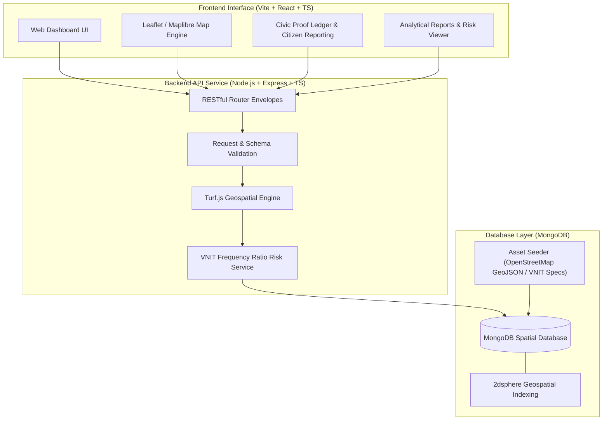

# Jal Setu Nagpur — GIS-Based Urban Flood Intelligence Platform

> **Data-driven urban flood risk modeling, spatial drainage analysis, citizen crowd-reporting, and civic intervention tracking for Nagpur, Maharashtra.**

---

## 🌊 Overview & Context

Nagpur faces recurrent, severe urban flooding during monsoon events due to rapid urbanization, inadequate drainage capacity, natural channel encroachments, and high clayey soil content. The catastrophic flood of **September 23, 2023** highlighted the urgent need for an integrated digital system to analyze hydrological vulnerabilities, guide municipal interventions, and empower citizen reporting.

**Jal Setu** (JAL-SETU-GIS) is an enterprise-grade GIS platform that digitizes Nagpur's drainage infrastructure, models spatial flood susceptibility using peer-reviewed geospatial parameters (VNIT Nagpur Frequency Ratio model), collects real-time crowdsourced citizen flood reports, and tracks civic desilting interventions.

---

## 🏗️ System Architecture



---

## 💡 Key Module Features

| Feature Module | Description | Technical Implementation |
| :--- | :--- | :--- |
| **Drainage Network Mapping** | Interactive spatial visualization of rivers, streams, drains, and nullahs across Nagpur. | Bounding box spatial queries (`2dsphere` indexed GeoJSON), OpenStreetMap Overpass ingestion. |
| **Topography & Susceptibility Intelligence** | Analysis of elevation, slope, TWI, landforms, soil texture, and LULC. | VNIT Nagpur 10-parameter Frequency Ratio (FR) statistical susceptibility model. |
| **Rainfall & Historical Events** | Chronological and spatial mapping of major historical flood events (e.g. Sept 2023 flood). | Aggregated historical storm event records, rainfall statistics, and flood centroids. |
| **Civic Proof Ledger** | Crowdsourced citizen flood reporting with depth indicators (ankle, knee, waist, above waist) & proof photos. | Express validation endpoints, spatial Point storage, verified/pending status workflows. |
| **Intervention & Work Order Tracking** | Municipal desilting project tracking, before/after photo evidence, cost estimates, and completion status. | MongoDB `interventions` collection with `PATCH` status updates (`planned`, `in_progress`, `completed`). |

---

## 📂 Project Structure

```
JAL-SETU-GIS/
├── assets/                                  # Raw spatial datasets & provenance specifications
│   ├── JalSetu_Nagpur_MasterPlan.md.pdf   # Master plan & requirements
│   ├── nagpur_drainage.geojson             # OSM Overpass drainage network GeoJSON
│   ├── nagpur_known_flood_locations.geojson # Historical flood point centroids
│   ├── nagpur_flood_data.json               # VNIT model, ward descriptions, city metadata
│   ├── data_sources.json                    # Dataset provenance tracking
│   ├── fetch_drainage_osm.py                # Python scraper for OSM Overpass API
│   └── geocode_hotspots.py                 # Geocoding helper script for flood hotspots
├── backend/                                 # Express.js + TypeScript REST API
│   ├── src/
│   │   ├── config/                          # App & environment configuration
│   │   ├── data/                            # Database seeder module
│   │   ├── db/                              # MongoDB client connection & index builder
│   │   ├── routes/                          # 13 REST API route controllers
│   │   ├── services/                        # Spatial risk calculator & Turf.js service
│   │   ├── types/                           # TypeScript interfaces & GeoJSON definitions
│   │   ├── utils/                           # BBox parsers & validation schemas
│   │   └── server.ts                        # Express server entrypoint & error middleware
│   ├── package.json
│   ├── tsconfig.json
│   └── README.md                            # Detailed Backend API Documentation
└── frontend/                                # Vite + React + TypeScript Dashboard
    ├── src/
    │   ├── components/                      # UI components (Map controls, ledger forms, filters)
    │   ├── pages/                           # Application views (Topography, Drainage, Ledger, Reports)
    │   ├── services/                        # API fetch service layer
    │   ├── App.tsx                          # Main app router & layout
    │   └── index.css                        # Modern CSS styling system
    ├── package.json
    └── vite.config.ts
```

---

## 🛠️ Tech Stack Matrix

| Layer | Technology | Purpose |
| :--- | :--- | :--- |
| **Frontend UI Framework** | React 18 + TypeScript | Component-driven reactive user interface |
| **Frontend Build Tool** | Vite | Lightning-fast HMR and production bundle optimization |
| **Styling** | Vanilla CSS3 + Modern Tokens | Custom CSS design system, dark glassmorphism, responsive grid |
| **Geospatial Visualization**| Leaflet / Maplibre GL | High-performance interactive tile and vector rendering |
| **Backend Runtime** | Node.js (v18+) + TypeScript | Type-safe asynchronous server execution |
| **Web Framework** | Express v5 | HTTP routing, CORS management, error envelopes |
| **Database** | MongoDB (v6.0+) | Document store with `2dsphere` spatial indexing |
| **Geospatial Processing** | Turf.js (`@turf/turf`) | Server-side point-in-polygon, line distance, and proximity calculation |
| **Analytical Model** | Frequency Ratio (FR) Model | Peer-reviewed statistical flood susceptibility algorithm (VNIT Nagpur) |

---

## 🚀 Quick Start & Installation

### Prerequisites

- **Node.js**: v18.0.0 or higher
- **npm**: v9.0.0 or higher
- **MongoDB**: Local MongoDB instance running on `mongodb://localhost:27017` or MongoDB Atlas URI.

---

### 1. Environment Configuration

#### Backend Setup (`backend/.env`)
Create a `.env` file inside the `backend/` directory based on `.env.example`:
```env
PORT=5050
MONGO_URI=your_mongodb_connection_uri
DB_NAME=your_database_name
CORS_ORIGINS=http://localhost:5173,http://localhost:5174
```

#### Frontend Setup (`frontend/.env`)
Create a `.env` file inside the `frontend/` directory:
```env
VITE_API_BASE_URL=http://localhost:5050/api
```

---

### 2. Backend Installation & Database Seeding

```sh
# Navigate to backend directory
cd backend

# Install dependencies
npm install

# Start backend server in development mode (with automatic database seeding)
npm run dev:seed
```

> **Note**: The `--seed` flag parses spatial assets from `assets/` and populates MongoDB collections with spatial 2dsphere indexes.

---

### 3. Frontend Installation & Execution

Open a new terminal window:

```sh
# Navigate to frontend directory
cd frontend

# Install dependencies
npm install

# Start Vite development server
npm run dev
```

Access the Jal Setu GIS dashboard at: **`http://localhost:5173`**  
Backend REST API available at: **`http://localhost:5050/api`**

---

## 🔬 Data Provenance & References

All analytical models and GIS spatial layers in Jal Setu are derived from published academic research and official municipal data:

1. **VNIT Nagpur Frequency Ratio Flood Model**:  
   Gaurkhede & Adane (2023). *Flood susceptibility mapping of Nagpur city using Frequency Ratio model.*  
   [Research Paper Link](https://aloki.hu/pdf/2103_23412361.pdf)
2. **OpenStreetMap Drainage Network**:  
   Ingested via Overpass Turbo queries covering Nagpur Municipal Corporation (NMC) boundaries.
3. **NMC Ward Boundary & Prabhag Data**:  
   38-Prabhag administrative structure and named nullah descriptions published by NMC / Nagpur Today.
4. **Historical Flood Events**:  
   Compiled from official government disaster management reports, news archives (Nagpur Today, Times of India), and satellite flood extent reports.


