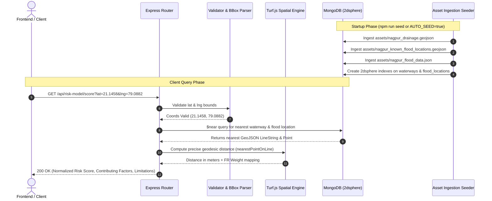

# Jal Setu Backend — REST API & Spatial Services Documentation

> **High-performance Express.js + TypeScript API providing spatial GeoJSON querying, MongoDB 2dsphere indexing, Turf.js spatial calculations, and VNIT Frequency Ratio flood risk modeling.**

---

## 🛠️ Architecture & Data Ingestion Flow



---

## ⚙️ Environment Configuration

Create a `.env` file in the `backend/` directory based on `.env.example`:

```env
PORT=5050
MONGO_URI=your_mongodb_connection_uri
DB_NAME=your_database_name
CORS_ORIGINS=http://localhost:5173,http://localhost:5174
```

### Environment Variables Reference

| Variable | Type | Default / Required | Description |
| :--- | :--- | :--- | :--- |
| `PORT` | Number | `5050` | HTTP listening port for Express backend |
| `MONGO_URI` | String | **Required** | MongoDB connection URI (e.g., `mongodb://localhost:27017` or Atlas cluster URI) |
| `DB_NAME` | String | `jal_setu` | MongoDB database name |
| `CORS_ORIGINS` | String | `http://localhost:5173,http://localhost:5174` | Comma-separated CORS allowed origins |

---

## 🗄️ Database Collections & Spatial Indexing

The MongoDB instance utilizes standard document schemas and native geospatial indexes:

| Collection | Geospatial Index | Description |
| :--- | :--- | :--- |
| `waterways` | `2dsphere` on `geometry` | OSM drainage network features (LineString / MultiLineString). |
| `flood_locations` | `2dsphere` on `geometry` | Known historical flood location centroids (Point). |
| `citizen_reports` | `2dsphere` on `location` | Crowdsourced citizen reports with depth and photo evidence. |
| `interventions` | Text index on `work_order_id` | Municipal work orders and desilting project tracking. |
| `risk_model` | Standard | Full parameter lookup tables for VNIT Frequency Ratio model. |
| `susceptibility_classes` | Standard | Flood susceptibility area classification breakdown. |
| `flood_events` | Standard | Chronological historical extreme flood events. |
| `nullahs` | Standard | Named channels and ward boundary landmark text references. |
| `wards` | Standard | NMC 38-Prabhag administrative structure. |
| `government_response` | Standard | Post-2023 flood municipal spending and infrastructure progress. |
| `city_metadata` | Standard | Nagpur administrative metadata, rainfall stats, and coverage. |
| `data_sources` | Standard | Ingestion provenance tracking for assets. |

---

## 📡 API Endpoint Reference

All response payloads follow a standardized JSON envelope structure:
```json
{
  "success": true,
  "data": { ... },
  "meta": { ... }
}
```

---

### 1. Health & Server Status

#### `GET /api/health`
Checks API status, database ping, connection health, and document counts per collection.

* **Response (200 OK):**
```json
{
  "success": true,
  "data": {
    "status": "healthy",
    "database": "connected",
    "uptime_seconds": 1420,
    "collections": {
      "waterways": 1420,
      "flood_locations": 28,
      "citizen_reports": 12,
      "interventions": 5
    },
    "timestamp": "2026-08-16T19:22:00.000Z"
  }
}
```

---

### 2. City Metadata

#### `GET /api/city`
Returns Nagpur city administrative metadata, land metrics, and infrastructure coverage.

* **Response (200 OK):**
```json
{
  "success": true,
  "data": {
    "name": "Nagpur",
    "municipal_area_km2": 217.56,
    "annual_avg_rainfall_mm": 1205,
    "built_up_pct": 74.2,
    "drainage_sewage_infra_coverage_pct": 42.5
  }
}
```

---

### 3. Drainage Waterways (GIS)

#### `GET /api/waterways`
Returns GeoJSON waterway features with optional bounding box and waterway type filtering.

* **Query Parameters:**
  * `bbox` *(optional, string)*: Bounding box as `west,south,east,north` in decimal degrees (e.g. `79.05,21.10,79.15,21.20`).
  * `type` *(optional, string)*: Waterway filter (`river`, `stream`, `drain`, `canal`).

* **Response (200 OK):**
```json
{
  "success": true,
  "data": [
    {
      "osm_id": "way/12345678",
      "waterway": "drain",
      "name": "Chambhar Nallah",
      "geometry": {
        "type": "LineString",
        "coordinates": [[79.0812, 21.1412], [79.0850, 21.1450]]
      }
    }
  ],
  "meta": {
    "total": 1,
    "type_filter": "drain",
    "data_source": "OpenStreetMap waterways via Overpass Turbo export"
  }
}
```

#### `GET /api/waterways/stats`
Returns aggregated count of waterways grouped by type.

#### `GET /api/waterways/:osmId`
Retrieves a specific waterway feature by its OpenStreetMap ID (`osm_id`).

---

### 4. Flood Events & Hotspots

#### `GET /api/flood-events`
Returns historical extreme flood event records (e.g., September 23, 2023 flood).

#### `GET /api/flood-events/:index`
Returns a specific historical flood event by its 0-based index.

#### `GET /api/flood-locations`
Returns known flood location centroids with optional `bbox` and `category` filtering.

* **Query Parameters:**
  * `bbox` *(optional)*: `west,south,east,north`
  * `category` *(optional)*: Location risk classification category.

---

### 5. Risk Model & Spatial Scoring

#### `GET /api/risk-model`
Returns full parameter lookup tables for the VNIT Nagpur Frequency Ratio (FR) statistical flood susceptibility model.

#### `GET /api/risk-model/susceptibility`
Returns Nagpur flood susceptibility class area breakdown (`Very High`, `High`, `Moderate`, `Low`, `Very Low`).

#### `GET /api/risk-model/score`
Computes an empirical flood risk score for any given coordinate in Nagpur using Turf.js geospatial analysis and the VNIT FR model.

* **Query Parameters:**
  * `lat` *(required, number)*: Latitude (e.g. `21.1458`)
  * `lng` *(required, number)*: Longitude (e.g. `79.0882`)

* **Calculation Logic:**
  1. Finds nearest waterway using MongoDB `$near` index on `waterways`.
  2. Computes exact geodesic distance in meters via `turf.nearestPointOnLine`.
  3. Maps distance to VNIT FR weight table for `distance_from_river_m`.
  4. Includes baseline parameters for urban built-up land cover, clayey soil infiltration, and landforms.
  5. Computes proximity bonus for known flood location centroids.
  6. Returns normalized 0-100 risk score and documents data limitations.

* **Response (200 OK):**
```json
{
  "success": true,
  "data": {
    "lat": 21.1458,
    "lng": 79.0882,
    "overall_score": 7.82,
    "max_possible_score": 14.50,
    "normalized_score": 54,
    "factors": [
      {
        "parameter": "Distance from River/Waterway",
        "value_range": "200-400",
        "fr_value": 1.85,
        "max_fr": 2.41,
        "interpretation": "Increases flood risk"
      }
    ],
    "nearest_waterway": {
      "name": "Nag River",
      "type": "river",
      "distance_km": 0.285
    },
    "data_limitations": [
      "Altitude: Requires SRTM DEM raster data.",
      "Slope: Requires DEM-derived slope raster."
    ]
  }
}
```

---

### 6. Citizen Flood Reporting

#### `GET /api/citizen-reports`
Retrieves submitted citizen flood reports with optional filters.

* **Query Parameters:**
  * `bbox` *(optional)*: `west,south,east,north`
  * `status` *(optional)*: `pending` \| `verified` \| `resolved`
  * `limit` *(optional)*: Max reports to return (default `100`, max `500`).

#### `POST /api/citizen-reports`
Submits a new crowdsourced flood report.

* **Request Body:**
```json
{
  "location": {
    "type": "Point",
    "coordinates": [79.0882, 21.1458]
  },
  "estimated_depth": "knee",
  "description": "Water logging near Shankar Nagar Square blocking traffic.",
  "photo_url": "https://example.com/uploads/photo1.jpg"
}
```
* **Validation Rules:**
  * `location` must be a GeoJSON Point within valid latitude/longitude bounds.
  * `estimated_depth` must be one of: `ankle`, `knee`, `waist`, `above_waist`.
  * `description` is required (min 5 chars).

* **Response (201 Created):**
```json
{
  "success": true,
  "data": {
    "_id": "64f1a2b3c4d5e6f7a8b9c0d1",
    "status": "pending",
    "created_at": "2026-08-16T19:22:00.000Z"
  }
}
```

---

### 7. Municipal Interventions & Work Orders

#### `GET /api/interventions`
Retrieves municipal intervention records with optional status filtering (`planned`, `in_progress`, `completed`).

#### `POST /api/interventions`
Creates a new municipal work order / desilting intervention project.

* **Request Body:**
```json
{
  "work_order_id": "WO-2026-NMC-014",
  "type": "desilting",
  "description": "Desilting and obstacle removal along Nag River stretch near Sitabuldi bridge.",
  "status": "planned",
  "cost_estimate": 450000
}
```

#### `GET /api/interventions/:id`
Gets a single intervention by MongoDB `_id`.

#### `PATCH /api/interventions/:id`
Updates status, description, cost estimates, or photo proofs for an intervention.

* **Request Body:**
```json
{
  "status": "in_progress",
  "before_photo_url": "https://example.com/photos/before_wo14.jpg"
}
```

---

### 8. Analytics & Data Provenance

#### `GET /api/analytics/summary`
Returns aggregate spatial statistics across all database collections.

#### `GET /api/data-sources`
Returns provenance details for all ingested spatial datasets and candidate external APIs.

---

## ⚠️ Error Handling & Status Codes

All API errors return a standard JSON error envelope with specific error codes:

```json
{
  "success": false,
  "error": {
    "code": "VALIDATION_ERROR",
    "message": "Invalid citizen report data",
    "details": "estimated_depth must be one of: ankle, knee, waist, above_waist"
  }
}
```

| HTTP Status | Error Code | Cause / Description |
| :--- | :--- | :--- |
| `400 Bad Request` | `BAD_JSON` | Malformed JSON payload in HTTP request body. |
| `400 Bad Request` | `VALIDATION_ERROR` | Request payload failed schema validation rules. |
| `400 Bad Request` | `INVALID_BBOX` | Invalid bounding box format or out-of-bounds coordinates. |
| `400 Bad Request` | `INVALID_COORDINATES` | Latitude/Longitude query params missing or invalid. |
| `404 Not Found` | `NOT_FOUND` | Requested route or document ID does not exist. |
| `409 Conflict` | `DUPLICATE` | Work order ID already exists in database. |
| `500 Server Error` | `INTERNAL_ERROR` | Unexpected backend or database error. |
| `503 Unavailable` | `SERVICE_UNAVAILABLE` | Database is unreachable. |

---

## 📜 Development Scripts

Run the following scripts from inside the `backend/` folder:

```sh
# Start development server with live reload (tsx)
npm run dev

# Start development server and auto-seed database
npm run dev:seed

# Manually trigger database seeding
npm run seed

# Build TypeScript to dist/ directory
npm run build

# Start production server from dist/
npm start
```
